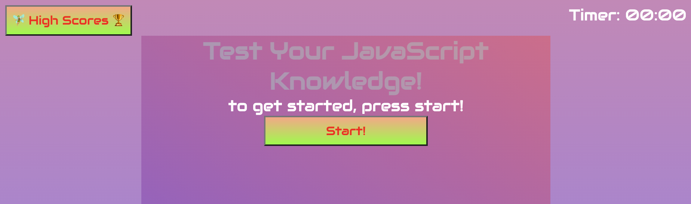

# JavaScript-Timed-Quiz
I made this quiz in order to test my knowledge of JavaScript, through creating the questions and answers, but more so in the making of the quiz itself. This application pushed me to the limits of my skill set over and over again. But I found that breaking it down into small steps and utilizing Chat GPT when I got totally stuck. 

💝 [Test your knowledge with my JavaScript quiz here](https://k8sterchi.github.io/JavaScript-timed-quiz/) 💝

## Application Preview

## User Story
>
AS A coding boot camp student
I WANT to take a timed quiz on JavaScript fundamentals that stores high scores
SO THAT I can gauge my progress compared to my peers
>
## Acceptance Criteria 
> 
GIVEN I am taking a code quiz

WHEN I click the start button

THEN a timer starts and I am presented with a question

WHEN I answer a question

THEN I am presented with another question

WHEN I answer a question incorrectly

THEN time is subtracted from the clock

WHEN all questions are answered or the timer reaches 0

THEN the game is over

WHEN the game is over

THEN I can save my initials and score>

## Helpful Resources
Chat GPT answered a lot of questions.

and since i am still learning css, these helped me style my quiz
https://www.w3schools.com/csS/css_font_google.asp font
https://www.w3schools.com/cssref/css_units.php css vw vh viewport
https://www.sitepoint.com/understanding-and-using-rem-units-in-css/ rem vs em units
